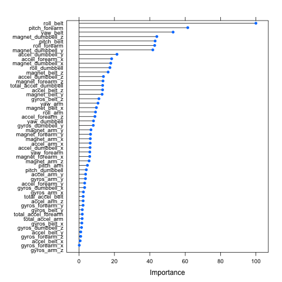
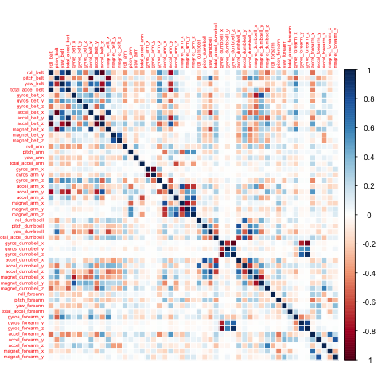

### Abstract

Human activity recognition (HAR) has become an emerging research area due to the increasing amount of weareble devices that allow to collect great amounts of data that can be used to the development of context aware systems. There are many applications for HAR, but in this project I will focus in detecting several types of body exercises and the problem of specifying correct execution, the automatic and robust detection of execution mistakes, and how to provide feedback on the quality of execution to the user. 

Data collection has been performed assigning six young health participants were asked to perform one set of 10 repetitions of the Unilateral Dumbbell Biceps Curl in five different fashions: exactly according to the specification (Class A), throwing the elbows to the front (Class B), lifting the dumbbell only halfway (Class C), lowering the dumbbell only halfway (Class D) and throwing the hips to the front (Class E).

Class A correspond with the perfect execution of the exercise, while the other ones are common mistakes when performing this exercise.

This work attemps to use machine learning techniques to predict the class of exercise every participant has preformed using the data available collected by means of wearebles.


### Data Retrieval

Datasets has been downloaded from the sources specified by the Prediction Assignment Writeup. It contains the measurements recorded on participant performing exercises in five ways, one correct way and other ones in a incorrect way.


```{r, eval=FALSE}
OS <- Sys.info()['sysname']
download <- function(url, file){
  if (grepl(OS, "Windows")){# windows environment
    download.file(url, file.path(workingDirectory, file))
  }else{ # linux osx must have curl installed
    download.file(url, file.path(workingDirectory, file), method = 'curl') 
  }
}

mapply(download,
        c('https://d396qusza40orc.cloudfront.net/predmachlearn/pml-training.csv', 
          'https://d396qusza40orc.cloudfront.net/predmachlearn/pml-testing.csv'), 
         file=c('pml-training.csv', 'pml-testing.csv'))

```

__pml-training.csv__ will bw used to train the model and the prediction and __pml-testing.csv__ will be used for testing the model and submit the results to Coursera.

### Data Cleanning

First things first. After downloading both data sets and load them into memory, data cleanning is carried out by checking those predictors with all values undefined.

```{r, eval=TRUE}

dfTraining <- read.csv(file='pml-training.csv',header=T, na.strings=c("NA", "#DIV/0!"))
dfTesting  <- read.csv(file = 'pml-testing.csv',header=T, na.strings=c("NA", "#DIV/0!"))
```

The training set has 19622 observations and 160 predictors
```{r, eval=FALSE}
dim(dfTraining) ## [1] 19622   160
```
The testing set has 20 observations and 160 predictors
```{r, eval=FALSE}
dim(dfTesting) ## [1]  20 160
```

After sifting for predictors with a complete set of observables, the dimension of the training data set
is reduced to 60 predictors

```{r, eval=TRUE}
dfTraining.nona <- dfTraining[,colSums(is.na(dfTraining))==0]
dfTesting.nona <- dfTesting[,colSums(is.na(dfTesting))==0]

```

The training set has 19622 observations and 60 predictors
```{r, eval=FALSE}
dim(dfTraining.nona) ## [1] 19622    60
```
The testing set has 20 observations and 60 predictors
```{r, eval=FALSE}
dim(dfTesting.nona) ## [1] 20 60
```
A look into the variables show that the first seven ones are not related to measurements and are possible confounders withdrawn from the data sets. The 60th column of the testing data set is just a problem identifier and it is also removed.
```{r, eval=TRUE}
dfTraining.clean <- dfTraining.nona[, -c(1:7)]
dfTesting.clean <- dfTesting.nona[, -c(1:7, 60)]
```

### Exploratory Data Analysis 

Searching for correlation 

```{r, eval=FALSE}
# correlation
predictors <- subset(dfTraining.clean, select = -c(classe))
M<- abs(cor(predictors))
diag(M) <-0
```
```{r, eval=F}
which(M>0.98, arr.ind=T)
```

Correlation Matrix
```{r, eval=F}
corretationMatrixPlot <- cor(predictors[, -length(names(predictors))])
corrplot(corretationMatrixPlot, method="color")
```


It is found that ___roll_belt___ is very correlated with all predictors as shown in correlation plot, 

### Machine Learning Process

#### Data Partitioning

We create a data partition assigning 70% of data set to train data set and 30% to testing data set. 

```{r, eval=F}
indexTrain <- createDataPartition(dfTraining.clean$classe, p=0.7, list=F)

dfTraining.train <- dfTraining.clean[indexTrain,]
dfTesting.train <- dfTraining.clean[-indexTrain,]
```

Random forest has been selected as prediction model because can be used to rank the importance of variables in a regression or classification problem in a natural way. It can also automatically detect correlation between predictors.
We have used parallel computation to carry out the construction of the predictive model and repeated 2-fold cross validation has been used when applying the algorithm. We have used __Accuracy__ metric and tune grid with __mtry__ equals to __26__. We have selected a number of 1000 trees to construct the model.

```{r, eval=F}
clusters <- parallel::makeCluster(spec=detectCores() - 1, type='PSOCK')
registerDoParallel(clusters)

trainControlrcv<-trainControl(method='repeatedcv', number=2, repeats=6, allowParallel = T , verbose=T)
modelFit <- train(classe~., data=dfTraining.train, method='rf', trainControl=trainControlrcv,
                  metric='Accuracy', tuneGrid=data.frame(mtry=26), ntree=1000)

print(modelFit$bestTune$mtry)

print(modelFit$finalModel)

stopCluster(clusters)
```

After getting a train model, it is time to apply it to the testing set:

```{r, eval=FALSE}

predict <- predict(modelFit, dfTesting.train)

confusionMatrix(predict, dfTesting.train$classe)
outOfSampleError <- 1 - as.numeric(confusionMatrix(predict, dfTesting.train$classe)$overall[1])

print(outOfSampleError)

```

```{r, eval=F}
Confusion Matrix and Statistics

          Reference
Prediction    A    B    C    D    E
         A 1671    9    0    0    0
         B    1 1129    4    0    0
         C    2    1 1018   11    0
         D    0    0    4  951    0
         E    0    0    0    2 1082

Overall Statistics
                                         
               Accuracy : 0.9942         
                 95% CI : (0.9919, 0.996)
    No Information Rate : 0.2845         
    P-Value [Acc > NIR] : < 2.2e-16      
                                         
                  Kappa : 0.9927         
 Mcnemars Test P-Value : NA             

Statistics by Class:

                     Class: A Class: B Class: C Class: D Class: E
Sensitivity            0.9982   0.9912   0.9922   0.9865   1.0000
Specificity            0.9979   0.9989   0.9971   0.9992   0.9996
Pos Pred Value         0.9946   0.9956   0.9864   0.9958   0.9982
Neg Pred Value         0.9993   0.9979   0.9984   0.9974   1.0000
Prevalence             0.2845   0.1935   0.1743   0.1638   0.1839
Detection Rate         0.2839   0.1918   0.1730   0.1616   0.1839
Detection Prevalence   0.2855   0.1927   0.1754   0.1623   0.1842
Balanced Accuracy      0.9980   0.9951   0.9947   0.9929   0.9998


```


Confusion matrix plot shows an __accuracy__ of 99,42%, and an __out of sample error__ of 0,57%. __Sensitivity__ and __Specifity__ are around 99% too.


#### Variable Importance



#### Correlation Plot



### References

Velloso, E.; Bulling, A.; Gellersen, H.; Ugulino, W.; Fuks, H. Qualitative Activity Recognition of Weight Lifting Exercises. Proceedings of 4th International Conference in Cooperation with SIGCHI (Augmented Human '13) . Stuttgart, Germany: ACM SIGCHI, 2013.
Read more: http://groupware.les.inf.puc-rio.br/har#collaborators#ixzz3oaAssVxx